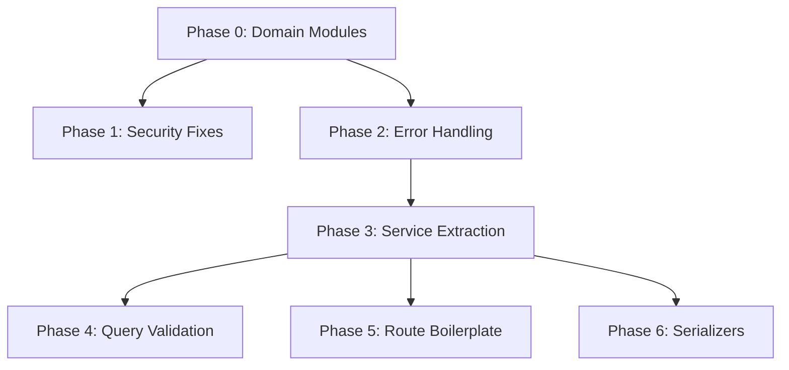

# API Structure Refactor Plan

The API currently has 38 controllers, 31 services, 30+ route files, and 14 utils all in flat directories. Controllers contain business logic, raw SQL, transactions, and serialization. Error handling varies across files, query params are unvalidated, and `app.ts` has 37 manual router imports. This plan addresses each issue in a dependency-aware order so each phase leaves the codebase working and deployable.

The key change in ordering: **directory restructuring comes first** so that all subsequent work (error handling, service extraction, etc.) happens in the correct module from the start, avoiding double-moves.

---

## Phase 0 -- Restructure into Domain Modules (2-3 days)

This is a purely mechanical move-and-rename phase. No logic changes -- just relocate existing files into a grouped structure and fix imports. This establishes the foundation so every later phase writes new code in the right place.

### 0a. Target directory structure

```
src/
  modules/
    sales/
      routes/
        salesOrders.ts
        invoices.ts
        quotations.ts
        receipts.ts
      controllers/
        salesOrdersController.ts
        invoicesController.ts
        quotationsController.ts
        receiptsController.ts
      services/
        salesTotals.ts
        bonusService.ts
        salesOrderInvoiceGuard.ts
        salesOrderStockValidation.ts
        invoicePosting.ts
        invoicePricingService.ts
        invoiceCreditNoteLines.ts
        invoiceHtml.ts
        invoiceBatchExpansion.ts
        salesCustomerBalance.ts
      index.ts                // barrel: registerSalesRoutes(app)
    purchases/
      routes/
        grns.ts
        purchaseOrders.ts
        supplierInvoices.ts
        supplierPayments.ts
        purchaseReturns.ts
      controllers/
        grnsController.ts
        purchaseOrdersController.ts
        supplierInvoicesController.ts
        supplierPaymentsController.ts
        purchaseReturnsController.ts
      services/
        grnPoValidation.ts
        grnInvoiceSettlement.ts
        purchaseTotals.ts
        supplierDueDateService.ts
        supplierPayables.ts
      index.ts
    inventory/
      routes/
        inventory.ts
        stockTransfers.ts
      controllers/
        inventoryController.ts
        stockTransfersController.ts
      services/
        inventoryService.ts
        stockLayerService.ts
        stockTransferPosting.ts
        productBatchControls.ts
      index.ts
    accounting/
      routes/
        accounts.ts
        journalEntries.ts
      controllers/
        accountsController.ts
        journalEntriesController.ts
      services/
        accountingPosting.ts
        glAccountService.ts
        periodLock.ts
      index.ts
    masters/
      routes/
        customers.ts
        suppliers.ts
        products.ts
        productCategories.ts
        units.ts
        towns.ts
        areas.ts
        customerTypes.ts
        priceLevels.ts
        bonusRules.ts
        warehouses.ts
        salespersons.ts
        taxProfiles.ts
        paymentTerms.ts
      controllers/
        customersController.ts
        suppliersController.ts
        productsController.ts
        productCategoriesController.ts
        unitsController.ts
        townsController.ts
        areasController.ts
        customerTypesController.ts
        priceLevelsController.ts
        bonusRulesController.ts
        warehousesController.ts
        salespersonsController.ts
        taxProfilesController.ts
        paymentTermsController.ts
      index.ts
    reports/
      routes/
        reports.ts
      controllers/
        reportsController.ts
      services/
        index.ts
        helpers.ts
        salesReports.ts
        inventoryReports.ts
        accountingReports.ts
        purchasesReports.ts
      index.ts
    settings/
      routes/
        companySettings.ts
        invoiceTemplates.ts
        approvals.ts
        notifications.ts
      controllers/
        companySettingsController.ts
        invoiceTemplatesController.ts
        approvalsController.ts
        notificationsController.ts
      services/
        companySettings.ts
      index.ts
    auth/
      routes/
        auth.ts
      controllers/
        authController.ts
      index.ts
    system/
      routes/
        health.ts
        audit.ts
        recycleBin.ts
        import.ts
        export.ts
      controllers/
        healthController.ts
        auditController.ts
        recycleBinController.ts
        importController.ts
        exportController.ts
      services/
        importRunners.ts
        listExportService.ts
      index.ts
  shared/
    middleware/               // existing middleware/ moves here
      auth.ts
      audit.ts
      errorHandler.ts
      requestId.ts
      validate.ts
      upload.ts
      reportsAccess.ts
    utils/                    // existing utils/ moves here
      asyncHandler.ts
      controllerResult.ts
      httpError.ts
      apiError.ts
      mapDbError.ts
      pagination.ts
      decimal.ts
      money.ts
      rounding.ts
      date.ts
      financialYear.ts
      tabularFile.ts
      templateWorkbooks.ts
      importColumnMap.ts
    constants/
      glAccounts.ts
    types/
      express.d.ts
```

### 0b. Module index barrel pattern

Each module exports a `register` function from its `index.ts`:

```typescript
// modules/sales/index.ts
import { Router } from 'express';
import { salesOrdersRouter } from './routes/salesOrders';
import { invoicesRouter } from './routes/invoices';
import { quotationsRouter } from './routes/quotations';
import { receiptsRouter } from './routes/receipts';

export function registerSalesRoutes(app: { use: Function }) {
  app.use('/sales-orders', salesOrdersRouter);
  app.use('/invoices', invoicesRouter);
  app.use('/quotations', quotationsRouter);
  app.use('/receipts', receiptsRouter);
}
```

### 0c. Clean up `app.ts`

Replace the 37 manual imports with ~9 register calls:

```typescript
import { registerAuthRoutes } from './modules/auth';
import { registerSalesRoutes } from './modules/sales';
import { registerPurchasesRoutes } from './modules/purchases';
import { registerInventoryRoutes } from './modules/inventory';
import { registerAccountingRoutes } from './modules/accounting';
import { registerMastersRoutes } from './modules/masters';
import { registerReportsRoutes } from './modules/reports';
import { registerSettingsRoutes } from './modules/settings';
import { registerSystemRoutes } from './modules/system';

// ... after middleware ...
registerAuthRoutes(app);
registerSalesRoutes(app);
registerPurchasesRoutes(app);
registerInventoryRoutes(app);
registerAccountingRoutes(app);
registerMastersRoutes(app);
registerReportsRoutes(app);
registerSettingsRoutes(app);
registerSystemRoutes(app);
```

### 0d. Execution strategy

Do not move all 70+ files in one commit. Work one module at a time:

1. Create the `modules/` and `shared/` folder structure
2. Move `shared/middleware/` and `shared/utils/` first (everything depends on these)
3. Then move modules in this order: **auth** (smallest, 2 files) -> **system** (health, audit, etc.) -> **masters** (simple CRUD) -> **accounting** -> **inventory** -> **reports** -> **purchases** -> **sales** (most dependencies, last)
4. After each module move, update all imports and verify the app compiles (`pnpm tsc --noEmit`)

### 0e. Import path updates

After moving files, relative import paths change. For example:

- `../../middleware/auth` becomes `../../shared/middleware/auth`
- `../services/salesTotals` becomes `../services/salesTotals` (stays the same if both moved into same module)
- Cross-module imports like a sales controller importing from `inventoryService` use `../../inventory/services/inventoryService`

TypeScript path aliases (if configured in `tsconfig.json`) can help keep cross-module imports clean:

```json
{ "paths": { "@shared/*": ["src/shared/*"], "@modules/*": ["src/modules/*"] } }
```

---

## Phase 1 -- Security and Quick Fixes (day 1)

Fix correctness/security bugs now that the files are in the right place.

### 1a. Add missing `requirePermission` on unprotected report routes

Two routes in `modules/reports/routes/reports.ts` (formerly `routes/reports.ts`) have no permission check:

- `GET /reports/grn-invoice-reconciliation`
- `GET /reports/dashboard/kpis`

Add appropriate `requirePermission(...)` calls (e.g. `purchases.reports:read` and `reports:read`).

### 1b. Fix `reportsAccess.ts` to use `effectivePermissions`

`shared/middleware/reportsAccess.ts` reads `req.auth?.permissions` (JWT only) instead of using the DB-aware `effectivePermissions` helper from `shared/middleware/auth.ts`. After a role change, this route disagrees with every other permission check. Either:

- Export `effectivePermissions` from `auth.ts` and use it in `reportsAccess.ts`, or
- Rewrite `requireTaxSummaryAccess` as a multi-permission variant of `requirePermission`

### 1c. Remove duplicate HttpError handling in `asyncHandler`

`shared/utils/asyncHandler.ts` catches `HttpError` and responds directly, but the centralized `errorHandler` middleware already handles `HttpError` identically. Simplify `asyncHandler` to just `fn(req, res).catch(next)` and let the global handler do its job.

---

## Phase 2 -- Standardize Error Handling (2-3 days)

Three different error patterns exist across controllers. Standardize to one.

### 2a. Introduce a richer `AppError` class

Replace the bare `HttpError` + ad-hoc string matching with a single `AppError` (extending `HttpError`) that carries an error code:

```typescript
// shared/utils/appError.ts
export class AppError extends HttpError {
  constructor(
    statusCode: number,
    public readonly code: string, // e.g. 'NOT_FOUND', 'DRAFT_ONLY'
    message: string,
    details?: unknown
  ) {
    super(statusCode, { error: code, message, details });
  }
}

export const NotFound = (entity?: string) =>
  new AppError(404, 'NOT_FOUND', entity ? `${entity} not found` : 'Not found');
export const DraftOnly = (entity: string) =>
  new AppError(400, 'DRAFT_ONLY', `Only draft ${entity}s can be edited`);
```

This replaces patterns like `throw new Error('Not found')` later caught with string matching in grnsController (line 377-381) and invoicesController (line 558-561).

### 2b. Integrate `mapDbError` into global `errorHandler`

Currently only grnsController and supplierInvoicesController use `handleControllerError` from `mapDbError.ts`. Move the DB constraint mapping into the global `errorHandler` middleware so Postgres errors (23505 unique, 23503 FK, 23502 NOT NULL) are automatically caught everywhere. Then remove per-controller try/catch wrappers.

### 2c. Eliminate manual try/catch in controllers

Scan all controllers and replace:

- `try { ... } catch (e) { if (e instanceof HttpError) throw e; throw new HttpError(400, ...) }` -- let errors propagate naturally
- `throw new Error('Not found')` inside transactions -- replace with `throw NotFound('GRN')` etc.

Goal: controllers and services throw `AppError`, the global `errorHandler` catches everything.

---

## Phase 3 -- Extract Business Logic into Services (5-7 days)

The highest-impact change. Fat controllers contain transactions, query building, entity creation, and domain rules. Move all of this into dedicated service files within each module.

### Target controller shape

```typescript
export async function createSalesOrder(req: Request, body: CreateSalesOrderInput): Promise<ControllerResult> {
  const order = await salesOrderService.create(body, req.auth?.userId);
  return created({ data: serializeSalesOrder(order, order.lines) });
}
```

### 3a. Fattest controllers first

Work in this order (already in the correct module after Phase 0):

1. **`modules/sales/controllers/invoicesController.ts`** (586 lines) -- Extract `invoiceService.ts`. The `createInvoice` function alone handles credit note validation, pricing, bonus calculation, totals, and SO guards.

2. **`modules/sales/controllers/salesOrdersController.ts`** (633 lines) -- Extract `salesOrderService.ts`. The `updateSalesOrder` has three branching code paths.

3. **`modules/purchases/controllers/grnsController.ts`** (498 lines) -- Extract `grnService.ts`. `postGrn` handles inventory movements, cost calculations, raw SQL, PO updates, journal posting, and PO auto-closing.

4. **`modules/masters/controllers/customersController.ts`** (373 lines) -- Extract `customerService.ts`. `getCustomerStatement` has 3 raw SQL queries in the controller.

5. **supplierInvoicesController**, **receiptsController**, **purchaseOrdersController** -- similar treatment.

### 3b. Simple CRUD controllers stay as-is

Controllers like `unitsController.ts` (65 lines) are already thin -- simple TypeORM calls with no transactions. Leave alone or refactor in Phase 5.

### 3c. Decouple report services from Express

Report functions in `modules/reports/services/salesReports.ts` directly import `Request` and read `req.query`. Services should accept plain parameters:

```typescript
// Before:
export async function dailySales(req: Request): Promise<ControllerResult> {
  const dateFrom = ((req.query.dateFrom as string) || '1970-01-01').slice(0, 10);

// After:
export async function dailySales(params: { dateFrom: string; dateTo: string; ... }): Promise<DailySalesResult> {
```

The controller becomes the thin adapter that reads `req.query` and calls the service.

---

## Phase 4 -- Query Parameter Validation (2-3 days)

### 4a. Define Zod schemas for list/filter query params

Currently query params are read with inline casts like `req.query.status as string`. The `validateQuery` middleware already exists in `shared/middleware/validate.ts` but is unused.

Create query schemas in `@tradeflow/shared` alongside existing body schemas:

```typescript
// packages/shared/src/validation/sales.ts
export const listSalesOrdersQuerySchema = z.object({
  customerId: z.string().uuid().optional(),
  status: z.enum(['draft', 'confirmed', 'void']).optional(),
  dateFrom: z.string().date().optional(),
  dateTo: z.string().date().optional(),
  warehouseId: z.string().uuid().optional(),
  q: z.string().optional(),
  hasInvoice: z.enum(['true', 'false']).optional(),
  limit: z.coerce.number().int().min(1).max(500).optional(),
  offset: z.coerce.number().int().min(0).optional(),
});
```

### 4b. Wire `validateQuery` into routes

Priority order:

1. Sales orders, invoices, GRNs (5-7 filters each)
2. Reports (dateFrom/dateTo/warehouse/customer on every endpoint)
3. Simple masters (search-only)

This also improves OpenAPI doc accuracy since query params become schema-driven.

---

## Phase 5 -- Reduce Route Boilerplate (2 days)

### 5a. Create a route builder utility

Every route file repeats `asyncHandler(async (req, res) => { sendControllerResult(res, await controller.fn(req, ...)); })`. Create a helper:

```typescript
function handle(fn: (req: Request) => Promise<ControllerResult>) {
  return asyncHandler(async (req, res) => {
    sendControllerResult(res, await fn(req));
  });
}

// Usage:
router.get('/', requirePermission('sales', 'read'), handle(controller.list));
```

### 5b. Optional: CRUD factory for simple masters

For the ~10 simple CRUD controllers (units, towns, areas, customer types, price levels, bonus rules, warehouses, salespersons, tax profiles, payment terms), extract a `createCrudRouter` factory that generates standard list/get/create/update/delete routes from a config object. Cuts ~50 lines of boilerplate per resource.

---

## Phase 6 -- Serializer Layer (1-2 days)

### 6a. Move serializers to dedicated files

Each controller has an inline `serializeXxx` function (e.g. `serializeSalesOrder` is 35 lines, `serializeCustomer` is 28 lines). Create `<entity>.serializer.ts` files within each module.

### 6b. Shared serialization helpers

Many serializers repeat:

- `field ?? null` for nullable fields
- `relation ? { id, name } : null` for joined entities
- Line item mapping with identical field lists

A small helper like `pick(entity, ['id', 'name', 'status'])` or `nullable(entity.field)` reduces repetition.

---

## Execution order and dependency graph



- **Phase 0** goes first -- establishes the module structure so all subsequent code lands in the right place
- **Phase 1** can happen in parallel with Phase 2 (both are small, independent fixes within the new structure)
- **Phase 2** must come before Phase 3 (clean error patterns before extracting services)
- **Phase 3** is the core refactor; Phases 4-6 build on it
- **Phases 4, 5, 6** are independent of each other and can be done in any order

## Key principles throughout

- **Every phase should leave the API fully working** -- no big-bang rewrite
- **No URL changes** -- all existing API paths stay the same; only internal structure changes
- **Tests before refactor** -- if coverage is thin, add integration tests for the fattest controllers (invoices, sales orders, GRNs) before Phase 3 so you catch regressions
- **One module at a time in Phase 0** -- do not move all 70+ files at once; migrate shared utilities first, then module by module (auth -> system -> masters -> accounting -> inventory -> reports -> purchases -> sales), verifying compilation after each
