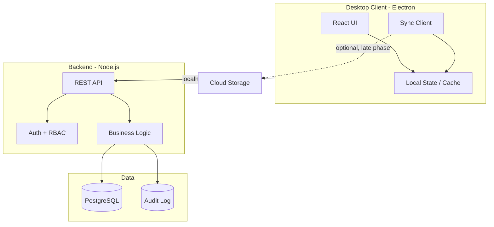

# TradeFlow – Comprehensive Plan

## Part A: High-Level Plan

### Tech Stack

| Layer | Choice | Rationale |

|-------|--------|-----------|

| **Desktop shell** | Electron | Mature, full Node.js + React support, single codebase; fits “desktop app” and optional cloud. Tauri is lighter but would use Rust instead of Node. |

| **Frontend** | React 18+ with TypeScript | Component-based UI, strong typing, large ecosystem. |

| **Styling** | Tailwind CSS | Utility-first styling, fast UI development. |

| **State** | Redux (RTK) + TanStack Query | Redux for app/auth/UI state; TanStack Query for server state and cache. |

| **Backend** | Node.js + Express.js with TypeScript | Same language as frontend; Express middleware for auth, RBAC, sync. |

| **Database** | PostgreSQL | Robust, ACID, JSON support; runs locally on the same machine as the app (localhost). |

| **ORM** | TypeORM | TypeScript-first entities, migrations, strong PostgreSQL support. |

| **Auth & RBAC** | JWT + role/permission tables | Stateless auth; roles: Admin, Accountant, Sales, Storekeeper. |

| **Sync (optional)** | Custom sync service + conflict resolution, or CouchDB/SQLite + sync layer | Phase 2/3: design APIs and “last-write-wins” or merge rules early. |

| **Reports / export** | Excel (e.g. ExcelJS), PDF (e.g. PDFKit or react-pdf) | For statements, tax reports, and exports. |

| **Audit** | Append-only audit table + “who, what, when” on critical entities | Strong audit logs as in idea. |

**Summary:** Electron + React (TypeScript) + Tailwind + Redux + TanStack Query; Node.js + Express (TypeScript) + TypeORM + PostgreSQL; JWT RBAC. Per-feature detailed plans are in the `plans/` folder.

### High-Level Architecture

- **Localhost-only:** The app runs on one machine: Electron renderer talks to Express API on localhost; PostgreSQL runs locally. No "offline" scenario—everything is on the same system. TanStack Query used for caching and performance only.
- **Multi-branch:** Same backend can serve multiple branches; branch_id on key tables; data isolation by branch.
- **Optional cloud sync (very low priority):** Data may be backed up or synced to an external service (e.g. Google Drive, OneDrive). Design this in the architecture phase (syncable data set, export format); implement at the end.

### Phased Delivery (aligned with idea.md)

- **Phase 1 (MVP):** Inventory (single-warehouse), Sales & Invoicing, Basic accounting (COA, double-entry, cash/bank, simple P&L/Trial balance), and core reports (daily sales, stock movement).
- **Phase 2:** Purchases (PO → GRN → supplier invoice), advanced accounting (journals, contra, full financial statements), tax reports, multi-warehouse and stock transfers.
- **Phase 3:** Logistics (routes, delivery notes, proof of delivery), dashboards (KPIs, inventory health, receivables/payables), integrations (Excel/CSV, backup/restore), and automation.

---

## Part B: Detailed Plan by Area

### 1. Core Architecture (Foundation)

**Desktop app structure**

- **Monorepo:** e.g. `apps/desktop` (Electron + React), `apps/api` (Express API), `packages/db` (TypeORM entities + migrations), `packages/shared` (types, constants, validation).
- **Electron:** Main process runs Node API (or connects to it); renderer runs React; IPC for app lifecycle, auto-updates, and “open file” if needed.
- **Modular feature set:** Each domain (Inventory, Sales, Accounting, etc.) as a module: own routes, services, and DB entities; shared auth and audit.

**Localhost-only**

- **Phase 1:** “Online-first with cache”: TanStack Query with `staleTime` and `gcTime`; show cached data when offline and surface “offline” banner; queue mutations and retry when online (TanStack Query persistence or custom queue).
- **Phase 2:** Optional local DB (e.g. SQLite) in Electron: sync service pulls/pushes with Postgres; conflict resolution (e.g. last-write-wins per entity or merge rules for numeric fields); sync status in UI.

**Sync (optional / Phase 2–3)**

- **Model:** Define “syncable” entities with `version` or `updated_at`; sync API: `GET /sync?since=<ts>` and `POST /sync` with batch upserts; idempotency and conflict handling in backend.
- **Multi-branch:** `branch_id` (or `tenant_id`) on all business tables; same codebase, data isolation by branch; cloud backup = sync to central store.

**Role-based access**

- **Roles:** Admin, Accountant, Sales, Storekeeper (from idea).
- **Implementation:** `users`, `roles`, `permissions` tables; many-to-many user–role; permission = resource + action (e.g. `inventory:write`, `sales:approve`). Middleware on every API checks permission; frontend hides/ disables by permission.
- **Audit:** Log `user_id`, `action`, `entity`, `entity_id`, `old/new` (or delta), `timestamp` in `audit_log`; never delete, only append.

**Tech tasks**

- Repo layout (monorepo), Electron + React + Express API bootstrap; Tailwind in React app; Redux store (auth, app state); TanStack Query for API data.
- PostgreSQL + TypeORM setup; base entities and migrations.
- JWT login + refresh; RBAC middleware and seed roles/permissions.
- Audit logging middleware and table design.
- TanStack Query for API data (caching and request handling); no offline detection or mutation queue (localhost-only).

---

### 2. Master Data Management

**Product & inventory masters**

- **Tables (conceptual):** `product_categories` (tree: parent_id), `products` (category_id, sku, barcode, unit_id, cost_price, selling_price, batch_tracked, expiry_tracked), `price_levels` (e.g. retail/wholesale), `product_prices` (product_id, price_level_id, price), `units_of_measure`.
- **APIs:** CRUD for categories, products, UoM, price levels; search/filter by category, SKU, barcode.
- **UI:** Category tree; product list with filters; product form (basic + batch/expiry toggles, multiple prices); barcode field and later barcode scanner support.

**Business masters**

- **Tables:** `customers` (type: retailer/wholesaler/walk-in, credit_limit, payment_terms_id, tax_profile_id), `suppliers`, `warehouses` (multi-warehouse from Phase 2), `salespersons`, `routes` (optional Phase 3), `tax_profiles` (rate, inclusive/exclusive, region).
- **APIs:** CRUD for each; customers with balance and credit-limit checks; suppliers; warehouses; salespersons; tax profiles.
- **UI:** List + form for each master; customer form with credit limit and payment terms; tax profile dropdown in product/customer.

**Tech tasks**

- Schema and migrations for all master tables; foreign keys and indexes (sku, barcode, branch_id if multi-tenant).
- Validation (e.g. Zod) in API and shared package.
- Master data APIs and RBAC (e.g. only Admin/Accountant can edit tax profiles).

---

### 3. Inventory Management Module

**Stock control**

- **Tables:** `warehouses`, `stock_ledger` or `inventory_movements` (product_id, warehouse_id, qty delta, ref_type: opening/purchase/sale/adjustment/transfer, ref_id), `stock_balances` (product_id, warehouse_id, qty) or derived view.
- **Real-time levels:** Update `stock_balances` in same transaction as movement; API and UI read from balances; movements for history.
- **Transfers:** `stock_transfers` (from_warehouse, to_warehouse, lines); two movements (out + in) in one transaction (Phase 2).
- **Opening balances:** Movement type “opening” with date; used for trial balance of stock.
- **Adjustments:** Movement type “adjustment” with reason (damage, loss, expiry); optional approval workflow (Phase 2).

**Advanced inventory (Phase 2)**

- **Alerts:** `products.min_stock`, `products.reorder_level`; job or on-demand check; notify in UI or dashboard.
- **Costing:** Store `unit_cost` per movement; FIFO/LIFO on issue (compute from movements); batch-wise valuation if batch_tracked.
- **Reports:** Dead stock (no movement in X days), slow-moving; queries on movements and balances.

**Tech tasks**

- `inventory_movements` and `stock_balances` (or materialized/summary table); triggers or app logic to keep balances consistent.
- APIs: get balance by product/warehouse; post movement (sale, purchase, adjustment, opening); list movements with filters.
- Stock transfer API and UI (Phase 2).
- Inventory reports (current stock, movement, reorder alerts) and expose to reporting module.

---

### 4. Sales & Invoicing Module

**Sales flow**

- **Entities:** `quotations`, `sales_orders`, `invoices`, `delivery_notes`; each with header (customer, date, status) and lines (product, qty, price, tax, discount).
- **State:** Quotation → Sales Order → Invoice; optional: Delivery Note linked to SO/Invoice. Support partial delivery (e.g. line-level delivered_qty).
- **Cash vs credit:** `invoices.payment_type` or separate “cash sale” path; credit = invoice with balance; receipts reduce balance.

**Invoicing**

- **Tables:** `invoices` (customer_id, date, due_date, subtotal, tax, discount, total, status), `invoice_lines` (product_id, qty, unit_price, tax, discount).
- **Business rules:** Compute tax from tax_profile (inclusive/exclusive); item and invoice-level discounts; rounding rule in settings.
- **Templates:** Store template identifier; render with company profile and line items (React-to-PDF or server-side PDF); allow custom formats in Settings (Phase 2).

**Customer management**

- **Credit limits:** Check `outstanding_balance + invoice_total <= credit_limit` on create invoice; block or warn in UI.
- **Payment terms:** e.g. net 30; compute `due_date` from terms.
- **Outstanding:** Derived from `invoices` and `receipts`; customer statement = list of invoices and payments; aging = bucket by 30/60/90 days (report).

**Tech tasks**

- Schema: quotations, sales_orders, invoices, delivery_notes and their lines; link to customers and products; double-entry entries (see Accounting).
- APIs: CRUD for quotation → SO → invoice; post invoice (create movements + accounting entries in one transaction); receipts; statement and aging endpoints.
- UI: Quotation/SO/Invoice list and forms; barcode scanning on invoice (product lookup by barcode); print/PDF invoice.
- Validation: credit limit, stock availability (reserve or check on confirm).

---

### 5. Purchase Management Module (Phase 2)

**Purchase flow**

- **Entities:** `purchase_requests`, `purchase_orders`, `grn` (goods received notes), `supplier_invoices`; returns and debit notes as negative flows.
- **Tables:** Same pattern as sales (header + lines); link PO → GRN → Supplier invoice; GRN creates inventory movement (purchase type) and optional accounting (accrual or on-invoice).

**Supplier controls**

- **Pricing history:** From PO/GRN/supplier invoice lines; report “supplier pricing history”.
- **Payables:** From supplier invoices and payments; supplier statement and aging (same pattern as receivables).

**Tech tasks**

- Schema for PR, PO, GRN, supplier_invoices and lines; supplier payments; link to inventory and accounting.
- APIs: CRUD and state transitions; post GRN (stock in + optional liability); post supplier invoice; payments.
- UI: PO list/form; GRN against PO; supplier invoice entry; supplier statement and aging.

---

### 6. Accounting & Finance Module

**Core accounting**

- **Chart of accounts (COA):** `accounts` (code, name, type: asset/liability/equity/income/expense, parent_id for hierarchy).
- **Double-entry:** `journal_entries` (date, ref, description), `journal_lines` (account_id, debit, credit); constraint: sum(debit) = sum(credit) per entry.
- **Cash & bank:** Sub-ledgers; `cash_account_id` / `bank_account_id` in settings; receipts and payments create journal lines to these + receivable/payable.
- **Contra & adjustments:** Manual journal entry API; types “contra”, “adjustment” with optional approval (Phase 2).

**Financial statements**

- **Trial balance:** Sum of journal_lines grouped by account, filtered by date range.
- **P&L:** Income and expense accounts; period comparison if needed.
- **Balance sheet:** Asset, liability, equity accounts; as of date.
- **Cash flow:** Derived from cash/bank movements or statement template (Phase 2).

**Payments**

- **Customer receipts:** Reduce receivable; debit cash/bank, credit receivable; link to invoice(s).
- **Supplier payments:** Debit payable, credit cash/bank; link to supplier invoice(s).
- **Partial payments:** Support multiple receipts per invoice; allocation logic (oldest first or explicit).

**Tech tasks**

- Schema: `accounts`, `journal_entries`, `journal_lines`; indexes on account_id and date.
- COA seed and API; journal entry API with balance check.
- Auto-post rules: on invoice (dr Receivable, cr Sales, cr Tax, etc.); on receipt (dr Cash, cr Receivable); on purchase invoice (dr Inventory/Expense, cr Payable); on payment (dr Payable, cr Cash).
- Report APIs: trial balance, P&L, balance sheet (by date range); payment recording UI and allocation.

---

### 7. Tax Management Module

**Tax setup**

- **Tables:** `tax_profiles` (name, rate, inclusive, region optional); link to products and customers; override at line level if needed.
- **Calculation:** Helper: given line amount and tax profile, compute base + tax; respect inclusive/exclusive.

**Tax reporting**

- **Collected:** From invoice lines (tax amount); period report.
- **Paid:** From purchase/supplier invoice lines; period report.
- **Output:** Tax summary (collected vs paid); audit breakdown (invoices/line-level); export Excel/PDF using same report data.

**Tech tasks**

- Tax calculation in shared package; use in sales and purchase flows.
- Tax report query (group by period, tax type); API and UI; Excel/PDF export.

---

### 8. Logistics & Distribution (Phase 3 – Optional)

**Delivery management**

- **Tables:** `routes`, `delivery_runs` (date, vehicle, driver), `delivery_notes` (linked to invoice or order), `proof_of_delivery` (signature/image reference).
- **APIs:** CRUD routes; create delivery run and assign orders; mark delivered with POD.

**Salesperson tracking**

- **Tables:** Link salespersons to invoices/orders; `salespersons` already in masters.
- **Reports:** Sales by salesperson, by route; commission = configurable rule on margin or value (Phase 3).

**Tech tasks**

- Schema for routes, delivery runs, delivery notes, POD; APIs and UI for delivery workflow; report: sales by salesperson/route.

---

### 9. Reporting & Analytics

**Operational reports**

- **Daily sales:** Invoices grouped by day; filters by customer/warehouse.
- **Stock movement:** From inventory_movements; filters by product, warehouse, date.
- **Purchase vs sales:** Compare PO/GRN to invoices in period.
- **Fast-moving:** Products by quantity or value sold in period; sort and filter.

**Financial reports**

- **Profit by product/customer:** From invoice lines (revenue) and COGS (from inventory costing); margin %.
- **Expense analysis:** From expense accounts in P&L.
- **Tax summaries:** Use tax module reports.

**Dashboards**

- **KPIs:** Today’s sales, month comparison; receivables/payables totals; low-stock count.
- **Charts:** Sales trend (daily/weekly); inventory value; aging pie/bar (Phase 2/3).

**Tech tasks**

- Report APIs with date range and filters; reuse existing aggregates (invoices, movements, journal lines).
- Report list and detail pages; parameter form (dates, customer, etc.); export to Excel/PDF.
- Dashboard: summary API (KPIs); React dashboard with charts (e.g. Recharts); cache with React Query.

---

### 10. Security, Controls & Auditing

**RBAC:** Covered in Core Architecture; implement permission checks on every API and key UI actions.

**Approval workflows (Phase 2):** e.g. “adjustment above X” or “journal above X” require approval; `approval_requests` table and status; notify approver (in-app or email later).

**Change logs:** Audit table with entity, entity_id, action, old/new (JSON), user_id, timestamp; no deletes of audit rows.

**Deleted record recovery:** Soft delete: `deleted_at` on main tables; filter out in normal queries; “recycle bin” UI to restore (Admin only).

**Data encryption:** Encrypt at rest (PostgreSQL TDE or disk-level); HTTPS in transit; hash passwords (bcrypt/argon2).

**Backups:** Scheduled DB backups (pg_dump or managed backup); optional export to S3/Azure (Phase 3); restore procedure documented.

**Tech tasks**

- Audit middleware and table; soft-delete on critical entities; recycle bin API and UI.
- Approval workflow tables and state machine; permission “approve_adjustments” etc.
- Backup script and docs; encryption in transit (TLS) and at rest (config).

---

### 11. Import / Export & Integration

**Data handling**

- **Excel/CSV import:** Template for products, customers, opening balances; validate rows (Zod); bulk insert with transaction; error report for failed rows.
- **Export:** Reports and lists to Excel (ExcelJS) and PDF; reuse report data layer.
- **Backup/restore:** DB dump/restore; optional “export all data” as JSON/CSV for portability (Phase 2).

**Integrations (future)**

- **Accounting:** Export COA and entries (e.g. CSV format for import elsewhere).
- **POS / Barcode:** API for product lookup by barcode; later webhook or file drop.
- **E-commerce:** Phase 3; sync orders or stock via API.

**Tech tasks**

- Import service: parse Excel/CSV, validate, insert; API and UI (upload + result).
- Export: Excel/PDF from report APIs; “Export” button on list and report screens.
- Document integration points (APIs and payloads) for future POS and accounting.

---

### 12. Settings & Customization

**Company profile:** Name, address, logo, tax registration number; table `company_settings` or key-value; used in invoice header and reports.

**Financial year:** Start month (e.g. July); used for period locking and reports.

**Currency & rounding:** Default currency; decimal places for money and qty; rounding rule (half-up, etc.) in calculations.

**Invoice templates:** Template id or name; layout options (fields to show); store in DB or file; render in PDF.

**Language & localization:** i18n keys in frontend (e.g. react-i18next); date/number formats from locale; Phase 2.

**Notifications:** In-app notifications (e.g. low stock); table `user_notifications`; optional email later (Phase 3).

**Tech tasks**

- Settings tables and API; UI: Company profile, financial year, currency, rounding; invoice template selector and editor (simple).
- i18n setup and key structure; notification table and “mark read” API; notification bell in header.

---

### 13. Scalability & Future Features

**Multi-company / multi-branch:** `branch_id` (or `company_id`) on all business tables from day one; filter all queries by branch; one DB or schema-per-tenant; sync if needed for central reporting.

**Mobile companion app:** Later; separate React Native or PWA; sync via same API; limit features (e.g. view stock, create simple sale).

**Web dashboard:** Same API; deploy React as web app for view-only or light operations; reuse 90% of code.

**AI demand forecasting / OCR:** Phase 3+; design product and invoice tables to support “forecast” and “scanned document” metadata; integrate when ready.

**Tech tasks**

- Add `branch_id` to schema from start; middleware to set branch from user/session; all queries scoped.
- Document extension points for mobile and web; keep API stateless and RESTful for reuse.

---

## Part C: Implementation Order (Summary)

1. **Repo + stack:** Monorepo, Electron, React, Express API, TypeORM, PostgreSQL, Redux, TanStack Query, Tailwind, JWT, RBAC, audit.
2. **Masters:** Categories, products, UoM, customers, suppliers, tax profiles, warehouses, salespersons.
3. **Inventory:** Movements, balances, single-warehouse; APIs and UI.
4. **Sales:** Quotations, SO, Invoices, delivery note; invoice posting (stock + accounting); receipts; statement/aging.
5. **Accounting:** COA, journals, double-entry; auto-post from invoice and receipt; trial balance, P&L, balance sheet.
6. **Reports:** Daily sales, stock movement, basic financial reports; export Excel/PDF.
7. **Phase 2:** Purchases, multi-warehouse, transfers, tax reports, advanced accounting, approval workflows.
8. **Phase 3:** Logistics, dashboards, integrations, automation, mobile/web prep.

This plan keeps your preferred stack (React, Node, TypeScript, PostgreSQL), aligns with the phased approach in [idea.md](idea.md), and adds concrete schema, API, and UI tasks for every module so you can execute step by step.